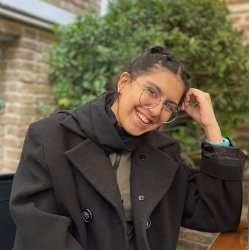

# Baran Saghafi
Urban Planning and Management Researcher · Tehran, Iran  

{:style="width:150px; border-radius:50%;"}

📧 [baransaghafiii@gmail.com](mailto:baransaghafiii@gmail.com) · [baransaghafi@ut.ac.ir](mailto:baransaghafi@ut.ac.ir)  
🔗 [LinkedIn](https://www.linkedin.com/in/baran-saghafi-3a6306245/) · [GitHub](https://github.com/baransaghafi)  
📱 [+98 910 911 7523](tel:+989109117523) · [Download CV (PDF)](/Baran%20Saghafi%20CV.pdf)

---

## Summary
As a graduate in Urban Development Management from the University of Tehran, I am passionate about exploring the intersection of urban planning and environmental sustainability. In my role as a teaching assistant at Tehran University, I have leveraged my expertise in both quantitative and qualitative methodologies to support academic growth and enhance the learning experience. Proficient in essential software tools such as GIS Pro and R, I am committed to applying innovative solutions to urban challenges. My strong interest in environmental issues drives me to actively engage with pressing concerns and contribute to sustainable urban development initiatives.

---

## Education
**M.Sc. Urban Development Management** — *University of Tehran* (2022–2025)  
Thesis: *Exploring the decision-making process in Iran's urban management and its long-term consequences according to the principles of environmental justice. Case study: Miankale Petrochemical Project*  

**B.Sc. Urban Planning** — *Pars University of Architecture and Art* (2018–2022)  
Thesis: *Crisis management and resilience of the city during the epidemic (Covid-19)*  

---

## Work Experience
**Teaching Assistant** — University of Tehran (2024–Present)  
- Coordinated and invigilated examinations, graded projects, and supported student learning.  
- Facilitated discussions, prepared materials, and organized field trips.  

**Facilitator** — SAP Consulting Engineers Co. (2024)  
- Led community engagement initiatives and collaborated with government organizations.  
- Conducted zoning and demographic analysis; updated land use and GIS data.  

**Teaching Assistant** — Pars University of Architecture and Art (2019–2022)  
- Assisted urbanism courses, graded assignments, and led workshops.  

---

## Service Activity
**Member** — Students’ Scientific Association of Urban Management, University of Tehran (2022–2024)  
- Coordinated outreach programs on urban sustainability and organized academic events.  

---

## Publications
1. *Review of Urban HSE and Crisis Management: Creating Resilient Green Cities in the Age of Pandemics* — Univ. of Tehran, 2024. [Link](https://civilica.com/doc/2129324/)  
2. *Analysis of permeable and impermeable surfaces: Case study Tehran District 7* — Univ. of Tehran, 2024. [Link](https://civilica.com/doc/2192147/)  
3. *Crisis management and resilience of the city during the epidemic (Covid-19)* — in preparation.  
4. *Exploring decision-making process in urban management and environmental justice: Miankale Petrochemical Project* — in preparation.  

---

## Coursework
- Cartography (ESRI) — 2024  
- R Programming in Urban Planning (UT) — 2024  
- WebGIS (ESRI) — 2024  
- CityEngine (SBU) — 2025  
- Python for GIS (UT) — 2025  

---

## Technical Skills
- GIS: ArcGIS, QGIS, WebGIS  
- Programming: R, Python (GeoPandas, NumPy, ArcPy)  
- Tools: MaxQDA, VOSviewer, MGWR, CityEngine, SPSS, AutoCAD, Revit, Photoshop  
- Microsoft Office & Project  

---

## Personal Skills
- Strong teamwork & communication  
- Organization & time management  
- Fast learner, adaptable under pressure  
- Experience with both **quantitative** (AHP-ANP, regression, spatial analysis) and **qualitative** (thematic/content analysis, interviews) research methods  

---

## Activities and Honors
- Elite Student Award — Pars University of Architecture and Art (2022)  
- Top 5 ranking student, B.Sc. Urban Planning (2022)  
- Student representative & event organizer (2019–2022)  

---

## Languages
- English — Full Professional Proficiency (IELTS 6.5)  
- Persian — Native  
- Japanese — Basic  

---

## References
- Dr. Neda Moayerian — Assistant Professor, Univ. of Tehran ([Email](mailto:nedamoayerian@ut.ac.ir))  
- Dr. Leila Mosleh — Assistant Professor, Univ. of Tehran ([Email](mailto:leilamosleh@gmail.com))  
- Dr. Mojgan Taheri Tafti — Assistant Professor, Univ. of Tehran ([Email](mailto:m.tafti@ut.ac.ir))  
- Dr. Farshad Nourian — Associate Professor, Univ. of Tehran ([Email](mailto:fnoorian@ut.ac.ir))  
- Mahdi Suleimany — Researcher, Univ. of Tehran ([Email](mailto:mi.suleimany@ut.ac.ir))  
